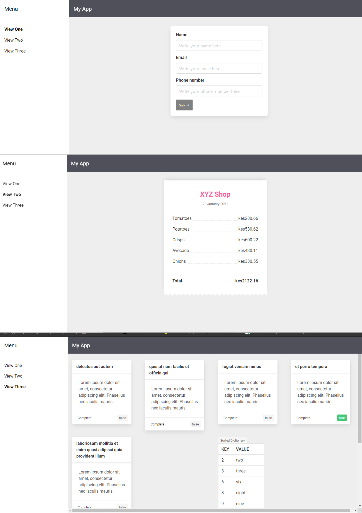
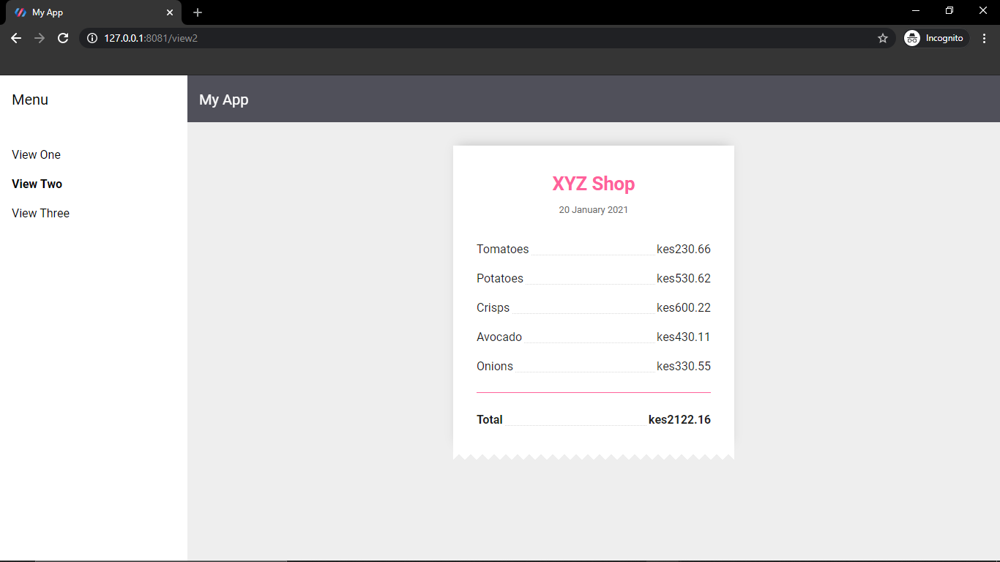
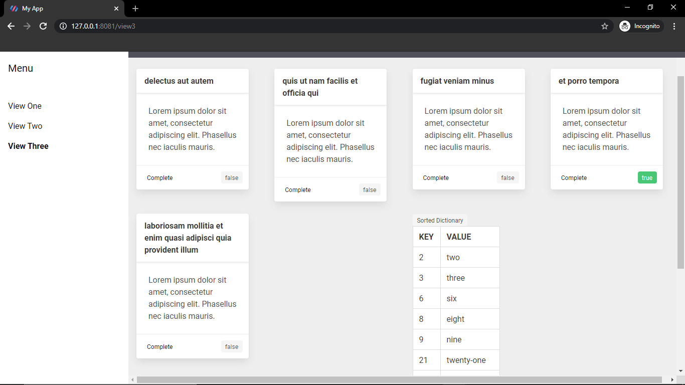

<h1 >MyApp</h1>


<h2 align="center">All the views</h2>

## Description

***
<p align="center">
</p>
<h2 align="center">View one</h2>
<p align="center"><a href="https://github.com/jmwakz99/interintel-frontend-test/blob/main/src/my-view1.js">View source code</a></p>

Converted the custom element called "my-view1" to a LitElement. I also created a form that captures user's name, email and phone number. Imported Bulma through cdn link and customized the inputs and buttons with bulma css. Wrote a javascript function that captures user information gotten from the inputs and displayed on both console and alert box.


<p align="center">
</p>
<h2 align="center">View two</h2>
<p align="center"><a href="https://github.com/jmwakz99/interintel-frontend-test/blob/main/src/my-view2.js">View source code</a></p>

Converted the custom element called "my-view2" to a LitElement and gave it a custom name of "my-element". I decided to create a shop receipt. Used plain css for styling. I also added some javascript functionality(looping over a list of items and displayed them on the receipt created and used javascript reduce() method to calculate the total value of the receipt).

<p align="center">
</p>
<h2 align="center">View three</h2>
<p align="center"><a href="https://github.com/jmwakz99/interintel-frontend-test/blob/main/src/my-view3.js">View source code</a></p>

Converted the custom element called "my-view3" to a LitElement.Added lit element lifecycle hook method. Took advantage of this method where I decided to make api call to fetch todos and also added the logic for sorting the dictionary. Displayed the list of todos from the response using cards which I had created using Bulma css. Also displayed the sorted dictionary on the polymer interface alongside the todo list. 


## Project setup
```
npm install
npm start
```